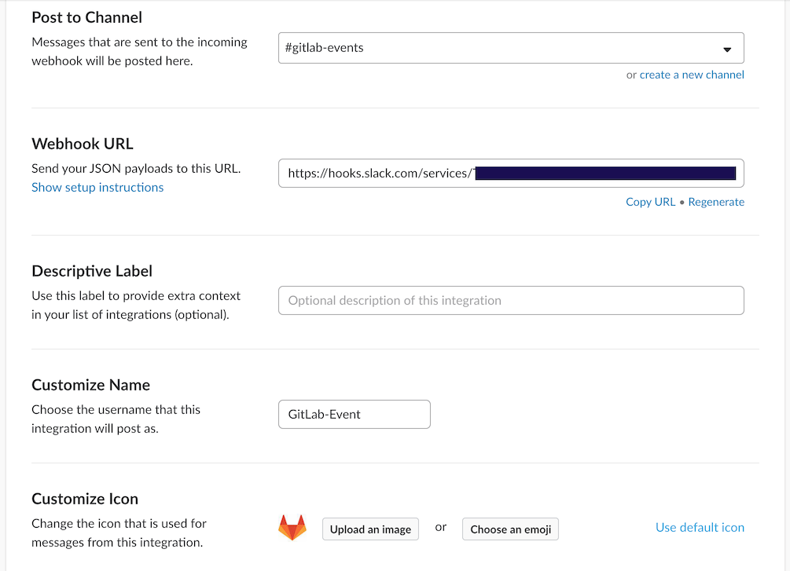
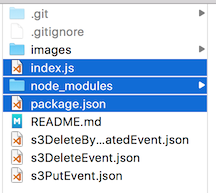
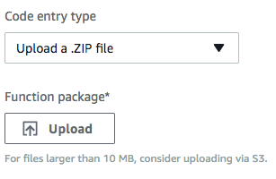
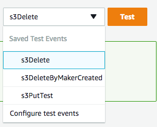
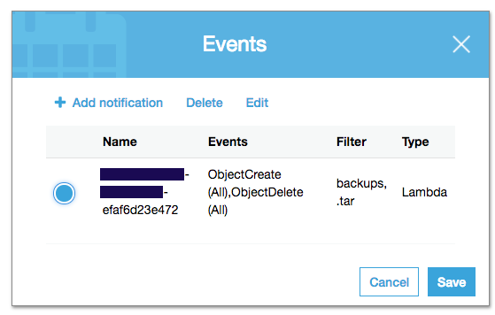
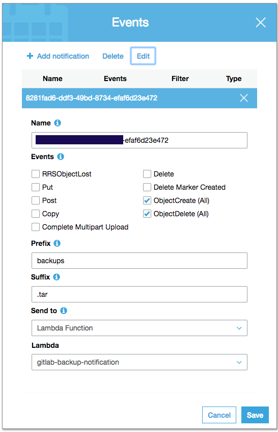

### Using aws lambda to notify slack trigge by S3 bucket action ###

In my case that using gitlab backup to S3 automatic and notify to slack after upload successfully or delete expired backups.

This is main steps:

#### Step 1: Create S3 bucket. ####
If using gitlab to upload backups that need `IAM` account to access bucket that will generate id and key to access S3. 

#### Step 2: Create a slack `Incoming WebHook` integration ####

[Slack message formatting reference](https://api.slack.com/docs/messages)

#### Step 3: Create lambda function. ####

**If require exteral node modules that will need upload .zip to lambda function first.**

NOTE:Only select main files inside the project. Don't zip whole project.

You can use buildin test json to test out your lambda function.

[S3 delete by maker created event example](s3DeleteByMakerCreatedEvent.json)

[S3 delete by expired event example](s3DeleteEvent.json)

[S3 create event example](s3PutEvent.json)

#### Step 4: Binding lambda to S3 event. ####

[Referece doc](https://docs.aws.amazon.com/AmazonS3/latest/user-guide/enable-event-notifications.html)

